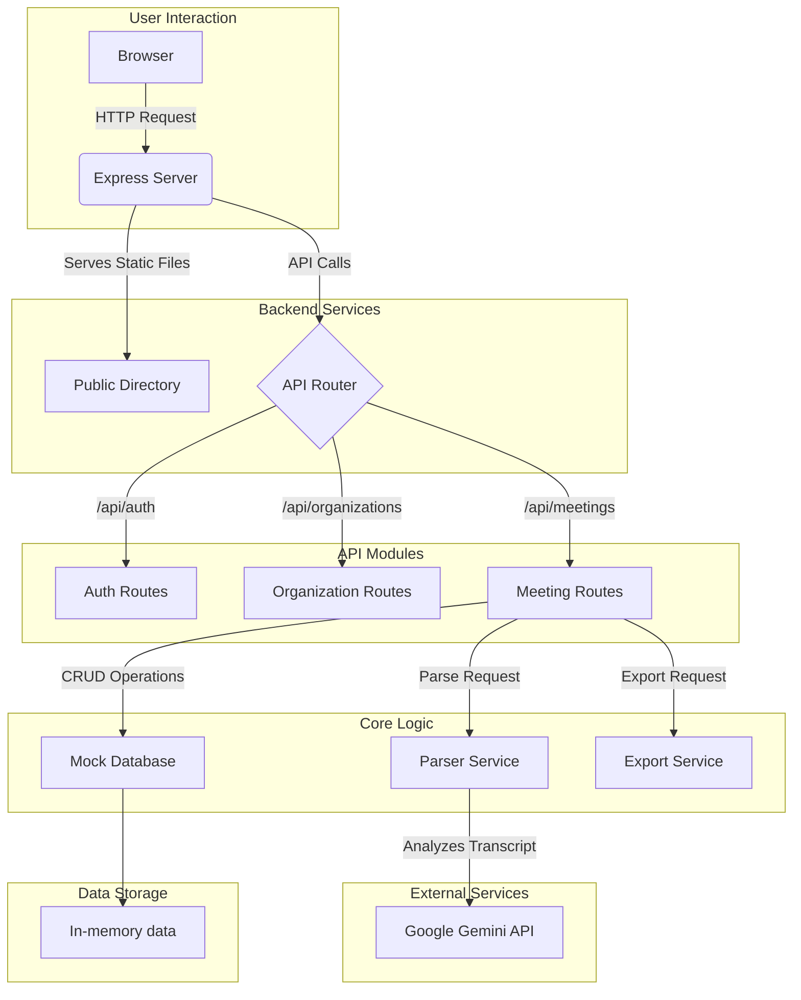
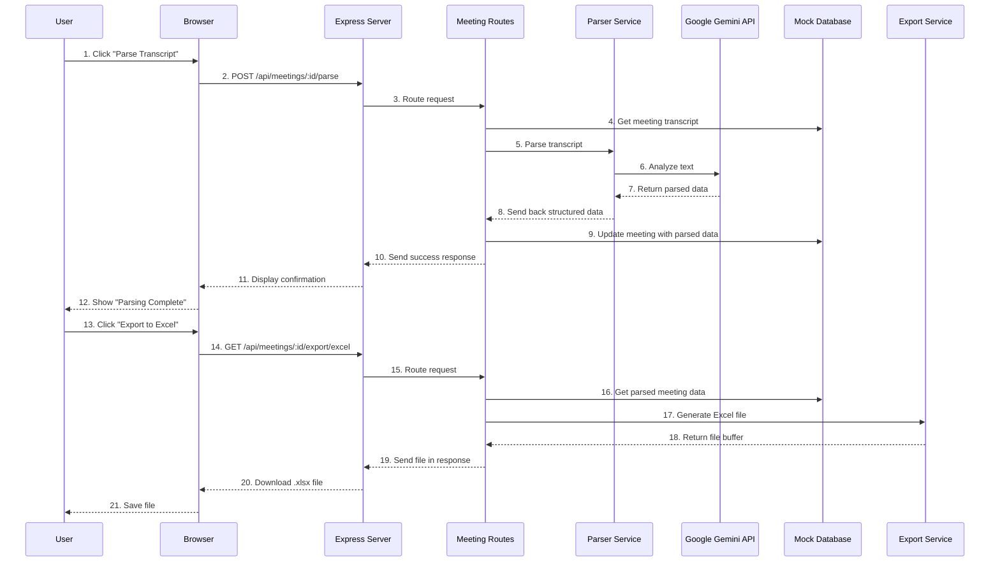

# Meeting Analysis and Export API

This project is a Node.js and Express-based backend application designed to manage, parse, and export meeting transcripts. It leverages AI to analyze transcript data, extracting key information like participants and action items. The application features a multi-tenant architecture, allowing data to be segregated by organization.

## Key Features

- **Organization-based Data:** Segregates meetings and users by organization.
- **AI-Powered Transcript Parsing:** Uses Google Gemini to parse meeting transcripts, identifying participants and action items.
- **Data Export:** Exports parsed meeting data to `.xlsx` (Excel) format.
- **RESTful API:** Provides a comprehensive set of endpoints for managing meetings and authentication.
- **Mock Authentication:** Includes a simple, header-based authentication stub for easy development and testing.
- **Frontend Client:** Comes with a basic web interface to interact with the API.

## Getting Started

Follow these instructions to get a copy of the project up and running on your local machine for development and testing purposes.

### Prerequisites

- [Node.js](https://nodejs.org/) (v18 or later recommended)
- [npm](https://www.npmjs.com/) (usually comes with Node.js)

### Installation

1.  **Clone the repository:**

    ```bash
    git clone https://github.com/ItsRudraksh/waterr-ai-assignment.git
    cd waterr-ai-assignment
    ```

2.  **Install dependencies:**
    ```bash
    npm install
    ```

### Configuration

1.  **Create a `.env` file:**
    Create a new file named `.env` in the root of the project by copying the example file.

    ```bash
    cp .env.example .env
    ```

2.  **Set environment variables:**
    Open the `.env` file and add the required environment variables.

    ```env
    PORT=5000
    GEMINI_API_KEY=your-api-key-here
    ```

    - `PORT`: The port on which the server will run. Defaults to `5000`.
    - `GEMINI_API_KEY`: Your API key for the Google Gemini service. You can obtain one from [Google AI Studio](https://aistudio.google.com/).

### Running the Application

- **Start the server:**
  ```bash
  npm start
  ```
- The server will be running at `http://localhost:5000`.
- You can access the web interface by navigating to this URL in your browser.

## API Usage

### Authentication

The application uses a mock authentication system based on the `x-org-id` request header. This header is used to simulate requests from different organizations.

- **`x-org-id: 1`**: Simulates a user from "TechCorp Solutions" (User ID: 1).
- **`x-org-id: 2`**: Simulates a user from "InnovateNow Inc" (User ID: 3).

If no header is provided, the API defaults to `x-org-id: 1`.

### API Endpoints

All endpoints are prefixed with `/api`.

#### Authentication (`/auth`)

- `POST /login`: Simulates user login.
- `GET /me`: Retrieves the current user's profile based on the `x-org-id` header.

#### Organizations (`/organizations`)

- `GET /`: Retrieves a list of all organizations.
- `GET /:id`: Retrieves details for a specific organization.

#### Meetings (`/meetings`)

- `GET /`: Retrieves all meetings for the current organization.
- `POST /`: Adds a new meeting.
- `GET /:id`: Retrieves details for a specific meeting.
- `POST /:id/parse`: Parses the transcript for a specific meeting.
- `POST /:id/reparse`: Re-parses an already processed transcript.
- `GET /:id/export/excel`: Exports a single meeting's parsed data to an Excel file.
- `GET /export/excel`: Exports all parsed meetings for the organization to an Excel file.

## High-Level Architecture

This diagram provides a visual overview of the application's components and their interactions.



## Data Flow Diagram

This diagram illustrates the flow of data when a user requests to parse a meeting transcript and then export the results.



## Project Structure

```
.
├── data/
│   └── mockDB.js         # Mock database and data access helpers
├── public/               # Frontend static files
│   ├── index.html
│   ├── script.js
│   └── style.css
├── routes/               # API route definitions
│   ├── auth.js
│   ├── meetings.js
│   └── organizations.js
├── services/             # Business logic and external service integrations
│   ├── export.js         # Handles data exporting (e.g., to Excel)
│   └── parser.js         # Handles transcript parsing with AI
├── .env.example          # Example environment variables
├── .gitignore
├── index.js              # Main application entry point
├── package.json
└── README.md
```
